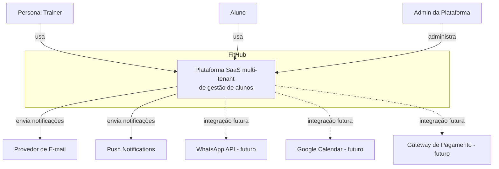
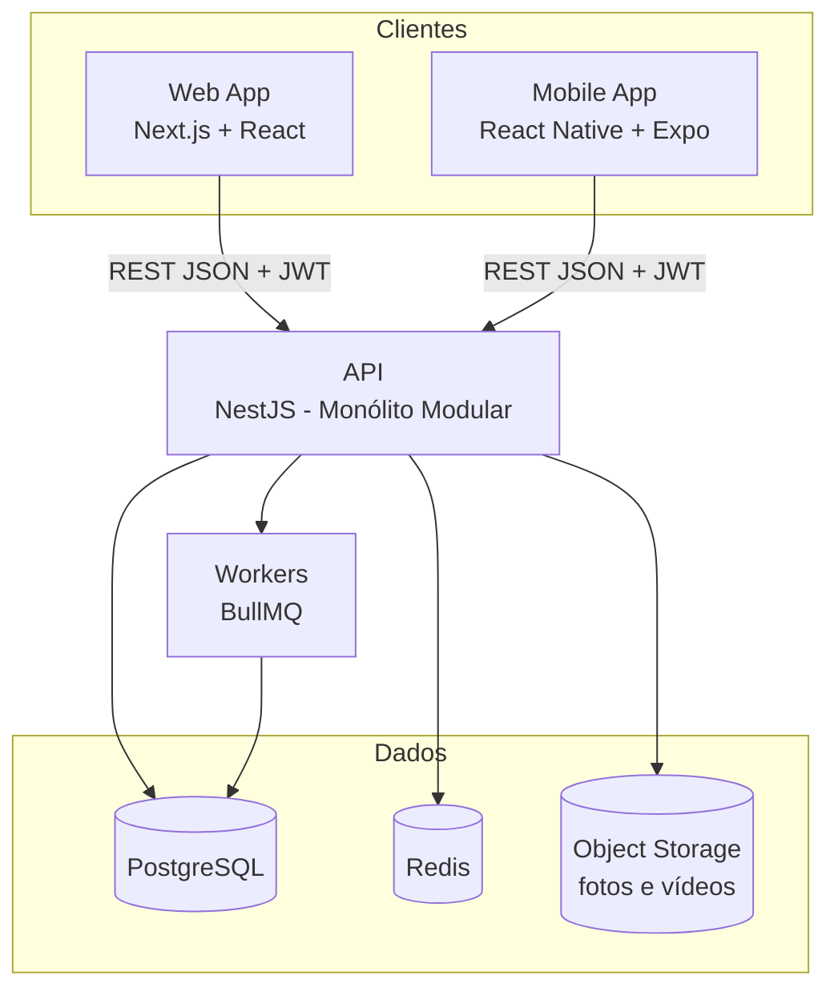
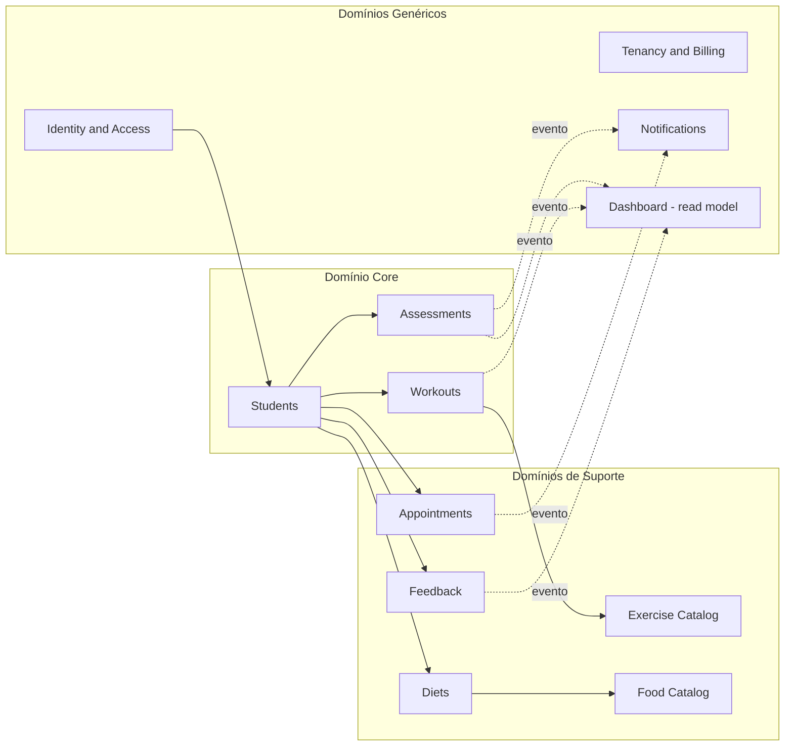
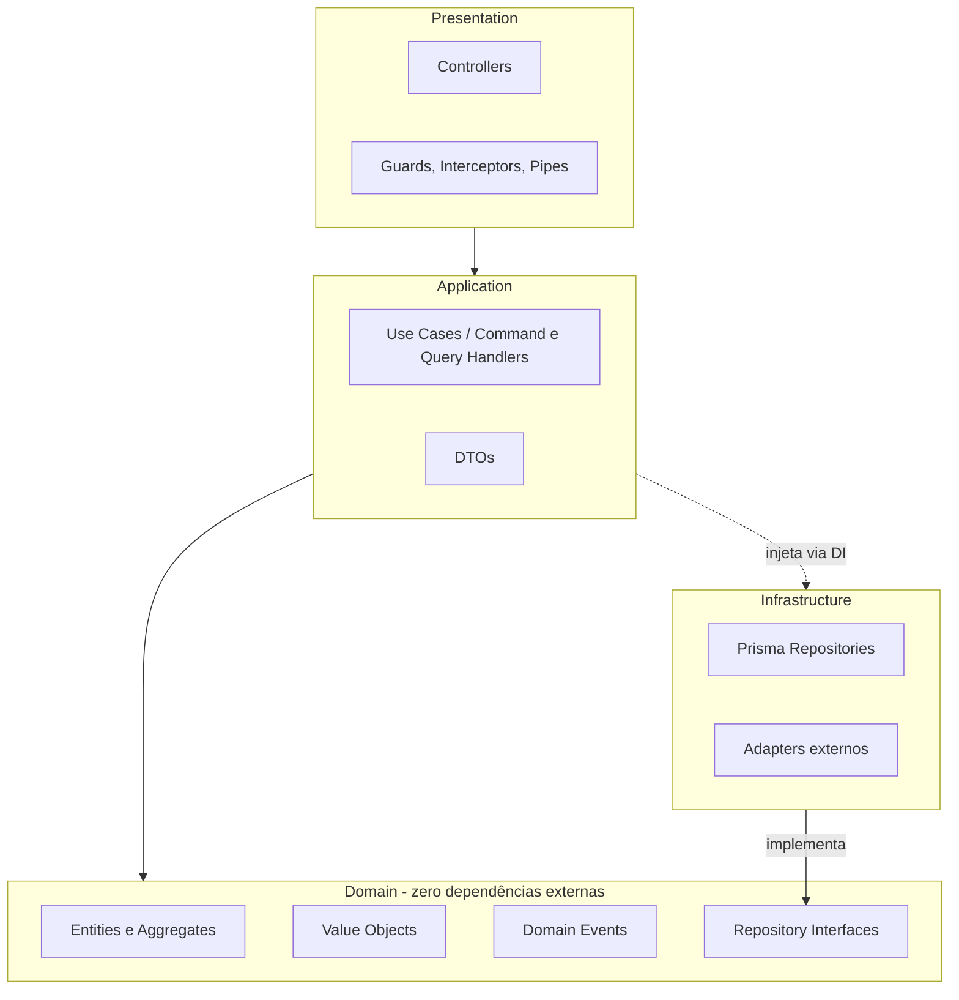

# FitHub — Arquitetura Completa

**Etapa 1 de 10** — Arquitetura → DDD → Banco de Dados → Prisma → Backend → Frontend → Mobile → Testes → Docker → Deploy

> Documento vivo. Cada etapa seguinte referencia as decisões tomadas aqui. Ajustes na arquitetura depois da Etapa 4 (Prisma) ficam caros — por isso vale revisar a seção 16 antes de eu seguir em frente.

## Sumário

1. Visão geral
2. Decisões arquiteturais — resumo executivo
3. Convenção de nomenclatura
4. Contexto do sistema (C4 — nível 1)
5. Contêineres (C4 — nível 2)
6. Estilo arquitetural: monólito modular
7. DDD — design estratégico
8. Clean Architecture — camadas
9. CQRS — onde faz sentido
10. Domain Events e comunicação entre módulos
11. Multi-tenancy — isolamento de dados
12. Identidade: User, TrainerProfile e Student
13. Estrutura de diretórios (monorepo)
14. Segurança
15. Escalabilidade e evolução
16. Decisões em aberto — preciso da sua confirmação
17. Próxima etapa

---

## 1. Visão geral

FitHub (nome provisório) é uma plataforma SaaS multi-tenant: cada Personal Trainer opera um ambiente isolado (tenant) onde gerencia alunos, treinos, avaliações físicas, dietas, feedbacks e evolução. Três perfis de usuário compartilham a mesma plataforma com níveis de acesso muito diferentes — Admin da Plataforma, Personal Trainer, Aluno.

Duas restrições não-negociáveis orientam praticamente toda decisão técnica deste documento:

1. **Isolamento de tenant é absoluto.** Nenhum dado de um personal pode vazar para outro — nem por bug de aplicação, nem por query mal escrita, nem por falha de configuração.
2. **O sistema precisa nascer pronto para produção**, não como protótipo: observabilidade, segurança, escalabilidade e testabilidade são requisitos de primeira classe desde o design, não extras adicionados depois.

**Premissa de escala assumida** (revisar se estiver errada): dezenas a poucas centenas de personal trainers ativos no primeiro ano, cada um com até algumas centenas de alunos. Essa premissa justifica diretamente a escolha de multi-tenancy da seção 11 — se a expectativa for centenas de milhares de tenants ou contratos enterprise com exigência contratual de isolamento físico, a estratégia muda.

## 2. Decisões arquiteturais — resumo executivo

| # | Decisão | Escolha | Por quê |
|---|---|---|---|
| 1 | Estilo arquitetural | Monólito modular | Menor custo operacional agora; fronteiras internas já preparam extração futura para microsserviços |
| 2 | Camadas internas | Clean Architecture (Domain / Application / Infrastructure / Presentation) | Regras de negócio isoladas do framework; testável sem banco/HTTP |
| 3 | Modelagem tática | DDD — Entities, Value Objects, Aggregates, Domain Events, Repository Pattern, Unit of Work | O domínio (avaliações, prescrição, evolução) tem regras reais demais para CRUD anêmico |
| 4 | Multi-tenancy | Banco único, schema único, coluna `tenantId` + Row-Level Security | Melhor custo-benefício para muitos tenants pequenos; isolamento reforçado em 4 camadas (seção 11) |
| 5 | CQRS | Seletivo — só em Dashboard e Evolução | Evita over-engineering nos módulos majoritariamente CRUD |
| 6 | Comunicação entre módulos | Domain Events in-process (`EventEmitter2`) | Baixo acoplamento agora; troca por message broker depois sem tocar no domínio |
| 7 | Repositório de código | Monorepo (`apps/api`, `apps/web`, `apps/mobile`, `packages/shared-types`) | Contratos (DTOs/Zod) compartilhados entre backend, web e mobile, sem duplicação |
| 8 | Nomenclatura | Código em inglês, documentação e UI copy em português | Convenção internacional de engenharia + mercado-alvo brasileiro |
| 9 | Autenticação | JWT curto + Refresh Token rotativo, hash com Argon2 | Segurança e revogabilidade |
| 10 | Identidade | `User` (auth) separado de `TrainerProfile` e de `Student` | Resolve a sobreposição entre os módulos "Usuários" e "Alunos" do briefing (detalhes na seção 12) |
| 11 | Catálogos (Exercícios/Alimentos) | Híbrido: base global + itens customizados por tenant | Reaproveita conteúdo curado sem travar a flexibilidade do personal |
| 12 | Armazenamento de mídia | Object Storage (S3-compatible), nunca blob no Postgres | Fotos e vídeos crescem rápido; banco relacional não é o lugar certo para isso |

## 3. Convenção de nomenclatura

- **Código — entidades, módulos, tabelas, campos, rotas, variáveis:** inglês. Padrão de fato em engenharia de software; evita ambiguidade e mantém o código legível para qualquer dev que entre no time.
- **Documentação, regras de negócio comentadas, textos de interface e mensagens de erro para o usuário final:** português.

Exemplo prático: a entidade é `Student`, a tabela é `students`, o endpoint é `POST /students`, mas a mensagem de erro devolvida ao personal é "Aluno não encontrado".

## 4. Contexto do sistema (C4 — nível 1)



- **Personal Trainer**: dono do tenant. Acesso total aos próprios alunos, treinos, avaliações, dietas e agenda.
- **Aluno**: acesso restrito aos próprios dados, quando o personal habilita seu acesso ao app (ver seção 12).
- **Admin da Plataforma**: não pertence a nenhum tenant. Gerencia tenants, planos, catálogo global e configurações da plataforma — sempre com trilha de auditoria (seção 11).

## 5. Contêineres (C4 — nível 2)



Três decisões aqui que não estavam explícitas no briefing, mas são obrigatórias para "produção":

- **Redis desde o dia um.** Não é opcional: cache de agregados do Dashboard, rate limiting, e backend de fila do BullMQ. Sem ele, notificações e relatórios não escalam.
- **Object Storage desde o dia um**, não disco local. Fotos de avaliação, fotos de aluno, vídeo de exercício — isso cresce rápido e quebra qualquer deploy com múltiplas instâncias ou containers imutáveis. As tabelas `Files`/`Photos` guardam metadado (URL, `tenantId`, dono, mimeType, tamanho); o binário vive no storage, servido via URL assinada com escopo de tenant.
- **Workers assíncronos (BullMQ) desde o dia um.** Envio de notificação, geração de PDF de dieta, processamento de imagem/vídeo — nada disso deve rodar dentro do ciclo request/response.

## 6. Estilo arquitetural: monólito modular

Microsserviços agora seriam overhead sem benefício real: equipe pequena, sem necessidade comprovada de escalar módulos de forma independente, e custo operacional (deploy, observabilidade, transações distribuídas) que não se paga nesse estágio. Monólito "tradicional" (sem fronteiras internas) resolve o problema de custo mas cria acoplamento que trava a manutenção conforme os 12 módulos crescem.

Monólito modular fica no meio: **deploy único**, mas fronteiras internas tratadas como se fossem fronteiras de serviço.

Regra dura, sem exceção: **um módulo nunca importa o repositório (Prisma) de outro módulo diretamente.** Se `Workouts` precisa de um dado de `Students`, ou (a) chama a Application Service pública de `Students` via injeção de dependência, ou (b) reage a um Domain Event publicado por `Students`. Isso é o que transforma uma eventual extração para microsserviço, no futuro, em um problema de infraestrutura — não de re-arquitetura.

## 7. DDD — design estratégico



- **Core Domain** (onde investimos mais modelagem, porque é onde está o diferencial competitivo): `Students`, `Workouts`, `Assessments`.
- **Supporting Subdomains** (necessários, sem ser o diferencial): `Diets`, `Feedback`, `Appointments`, catálogos de `Exercise`/`Food`.
- **Generic Subdomains** (problema já resolvido pelo mercado — não vale reinventar): `Identity/Auth`, `Notifications`, `Tenancy/Billing`.

`Students` é referenciado por quase todo o resto — trato isso como um **Shared Kernel restrito**: só `StudentId`, `TenantId` e alguns Value Objects (`Measurement`, `DateRange`) atravessam fronteiras de contexto livremente. `Dashboard` e `Notifications` são consumidores via Domain Events (relação Customer/Supplier) — nunca leem a tabela de outro módulo diretamente. `Tenancy` não aparece com setas no diagrama porque a relação dela com os demais é horizontal — via `tenantId` em toda entidade — não um fluxo de evento pontual.

## 8. Clean Architecture — camadas



A regra de dependência é a de sempre: camadas externas dependem das internas, nunca o contrário. `Domain` não importa NestJS, não importa Prisma, não sabe que existe HTTP. `Application` depende só das *interfaces* de repositório definidas em `Domain` — quem implementa é `Infrastructure`, conectada em runtime via injeção de dependência do NestJS. Isso é inversão de dependência na prática, não só no papel: dá pra testar um Use Case inteiro com um repositório fake, sem banco.

Três padrões que sustentam essas camadas:

**Repository Pattern** — a interface fica no domínio, a implementação Prisma fica na infraestrutura:

```typescript
// modules/students/domain/repositories/student.repository.interface.ts
export interface IStudentRepository {
  findById(id: StudentId, tenantId: TenantId): Promise<Student | null>;
  findAllByTenant(tenantId: TenantId, filters?: StudentFilters): Promise<Student[]>;
  save(student: Student): Promise<void>;
  delete(id: StudentId, tenantId: TenantId): Promise<void>;
}

export const STUDENT_REPOSITORY = Symbol('IStudentRepository');
```

Note que `tenantId` é parâmetro explícito em toda leitura — proposital: torna estruturalmente difícil esquecer o escopo de tenant, porque o código não compila sem passá-lo.

**Unit of Work** — implementado em cima de `prisma.$transaction`, para Use Cases que precisam coordenar múltiplos repositórios de forma atômica (ex: criar `Student` + disparar `StudentCreatedEvent` + atualizar contador do Dashboard).

**Result pattern para erros esperados de negócio** — exceptions ficam reservadas para o que é realmente excepcional (falha de infra, bug). Regras de negócio violadas (ex: "e-mail já cadastrado nesse tenant") retornam um `Result`, não lançam:

```typescript
// core/result.ts
export class Result<T, E = DomainError> {
  private constructor(
    public readonly isSuccess: boolean,
    private readonly _value?: T,
    private readonly _error?: E,
  ) {}

  static ok<T, E = DomainError>(value: T): Result<T, E> {
    return new Result<T, E>(true, value);
  }
  static fail<T, E = DomainError>(error: E): Result<T, E> {
    return new Result<T, E>(false, undefined, error);
  }
  get value(): T {
    if (!this.isSuccess) throw new Error('Result sem valor: verifique isSuccess antes.');
    return this._value as T;
  }
  get error(): E {
    return this._error as E;
  }
}
```

Essas três peças fazem parte do `core/` compartilhado e são a base de todo módulo — voltamos a elas com implementação completa na Etapa 5 (Backend). Aqui é só o contrato.

## 9. CQRS — onde faz sentido

CQRS completo (com event sourcing e read models separados fisicamente) seria over-engineering para módulos majoritariamente CRUD como `Students` ou `Diets` — ali, Use Case simples resolve com menos código e menos bugs.

Aplico CQRS **seletivamente**, só onde o padrão de leitura é genuinamente diferente do de escrita:

- **Dashboard**: agrega dados de `Students`, `Assessments`, `Feedback`, `Appointments` — é leitura pesada, cross-módulo, que não deveria forçar todo o resto do sistema a modelar suas entidades pensando em "como isso aparece no dashboard".
- **Evolução** (gráficos de peso/gordura ao longo do tempo): mesma lógica — leitura histórica, agregada, otimizada para série temporal.

Nesses dois casos, o lado de leitura consome os Domain Events dos módulos de origem para manter uma projeção própria (tabela ou view otimizada para consulta), em vez de fazer joins pesados em tempo real toda vez que o personal abre o dashboard.

## 10. Domain Events e comunicação entre módulos

Mecanismo: `EventEmitter2` (`@nestjs/event-emitter`) — pub/sub in-process. A interface de publicação (`IDomainEventPublisher`) fica no `core/`, então trocar por um message broker (RabbitMQ, SQS) mais tarde é uma troca de implementação, não uma reescrita de domínio.

Eventos centrais já identificados nessa etapa (lista completa vem na Etapa 2):

| Evento | Publicado por | Consumido por |
|---|---|---|
| `StudentCreatedEvent` | Students | Dashboard, Notifications |
| `StudentDeactivatedEvent` | Students | Dashboard |
| `AssessmentCreatedEvent` | Assessments | Dashboard, Notifications (ex: meta batida) |
| `WorkoutAssignedEvent` | Workouts | Notifications (push pro aluno) |
| `FeedbackSubmittedEvent` | Feedback | Dashboard, Notifications (ex: dor/dificuldade acima do limiar) |
| `AppointmentScheduledEvent` | Appointments | Notifications |

Evolução futura possível (não implementada agora, só deixando o caminho livre): Transactional Outbox, para garantir que o evento só é publicado se a transação de escrita realmente commitou — relevante quando o publisher deixar de ser in-process.

## 11. Multi-tenancy — isolamento de dados

Esse é o ponto mais crítico do sistema — "nunca misturar dados entre personais" foi repetido várias vezes no briefing, e trato como requisito de segurança, não só de negócio.

**Estratégia escolhida: banco compartilhado, schema único, coluna `tenantId`** em toda tabela tenant-scoped (Students, Workouts, Assessments, Diets, Feedback, Appointments...). Alternativas descartadas e por quê:

- *Schema por tenant*: isolamento mais forte, mas migração de schema vira uma operação O(n) tenants — inviável operacionalmente com centenas de tenants pequenos.
- *Banco por tenant*: isolamento máximo, custo de infraestrutura proibitivo nesse estágio.

Dado o perfil (muitos personais, cada um pequeno), o modelo pooled com defesa em profundidade tem o melhor custo-benefício. Isolamento forte fica reservado para uma eventual camada "enterprise" no futuro, se necessário (ver seção 16).

**Defesa em quatro camadas** (nenhuma delas sozinha é suficiente — juntas, sim):

**1. Convenção de schema.** Toda entidade tenant-scoped tem `tenantId` obrigatório, indexado, e frequentemente parte de unique constraints compostas (ex: e-mail de aluno único *por tenant*, não globalmente).

**2. `TenantContext` via `AsyncLocalStorage`.** Populado por um Guard logo na entrada da requisição, a partir das claims do JWT. Flui implicitamente por toda a call stack da requisição, sem precisar ser passado manualmente em cada função.

**3. Prisma Client Extension.** Intercepta toda query em modelo tenant-scoped e injeta `tenantId` automaticamente no `where` — mesmo que um desenvolvedor esqueça de filtrar manualmente, a extension filtra por ele.

```typescript
// infra/prisma/tenant-scoped.extension.ts (esqueleto ilustrativo — implementação completa na Etapa 5)
export function tenantScopedExtension(tenantContext: TenantContextService) {
  return Prisma.defineExtension((client) =>
    client.$extends({
      query: {
        $allModels: {
          async $allOperations({ model, args, query }) {
            if (TENANT_SCOPED_MODELS.has(model) && tenantContext.hasTenant()) {
              args.where = { ...args.where, tenantId: tenantContext.getTenantId() };
            }
            return query(args);
          },
        },
      },
    }),
  );
}
```

**4. PostgreSQL Row-Level Security**, como última linha de defesa — protege até contra query SQL crua ou bug na extension do Prisma.

```sql
ALTER TABLE students ENABLE ROW LEVEL SECURITY;

CREATE POLICY tenant_isolation_students ON students
  USING (tenant_id = current_setting('app.tenant_id', true)::uuid);
```

A extension do Prisma executa `SET LOCAL app.tenant_id = '<tenantId>'` no início de cada transação, e a policy do Postgres valida isso linha a linha.

```mermaid
sequenceDiagram
    participant C as Cliente Web/Mobile
    participant G as JwtAuthGuard
    participant CTX as TenantContext (AsyncLocalStorage)
    participant UC as Use Case
    participant PX as Prisma Client Extension
    participant PG as PostgreSQL (RLS)

    C->>G: Requisição HTTP + JWT
    G->>G: Valida token, extrai tenantId e role
    G->>CTX: Popula contexto da requisição
    G->>UC: Encaminha para o Use Case
    UC->>PX: prisma.student.findMany(...)
    PX->>PX: Injeta where.tenantId automaticamente
    PX->>PG: SET LOCAL app.tenant_id = tenantId; SELECT ...
    PG->>PG: Policy RLS valida tenant_id da linha
    PG-->>PX: Retorna só linhas do tenant
    PX-->>UC: Dados isolados
    UC-->>C: Resposta
```

**Exceção controlada: Admin da Plataforma.** É o único papel sem `tenantId` fixo. Mesmo assim, acesso a dado de um tenant específico (ex: suporte) passa por um fluxo explícito de "acesso assistido", sempre logado em auditoria — nunca um bypass silencioso das camadas acima.

## 12. Identidade: User, TrainerProfile e Student

O briefing original tem os módulos "1. Usuários" (login, senha, perfil, CREF, especialidade, bio) e "2. Alunos" (cadastro do aluno) como itens separados, mas com sobreposição real: o "Painel do Aluno" exige que um aluno também consiga fazer login. Resolvo assim:

- **`User`** (contexto Identity/Auth): autenticação pura — e-mail, hash de senha, `role` (`PLATFORM_ADMIN` | `PERSONAL_TRAINER` | `STUDENT`), `tenantId` (nulo só para `PLATFORM_ADMIN`), refresh tokens. Subdomínio genérico — não reinventamos autenticação.
- **`TrainerProfile`** (1:1 com `User` quando `role = PERSONAL_TRAINER`): CREF, especialidade, bio, avatar, telefone. Fica fora de `User` para manter autenticação enxuta e separada de dado de perfil.
- **`Student`** (contexto Students, é o registro do aluno gerenciado pelo personal): nome, sexo, nascimento, altura, objetivo, telefone, WhatsApp, observações, status, `tenantId`. Tem um `userId` **opcional** — um aluno existe como dado do personal sem nunca precisar logar; quando o personal habilita o acesso, um `User` com `role = STUDENT` é criado e linkado.

Isso evita duas armadilhas: forçar todo aluno a ter conta (fricção desnecessária pro personal que só quer registrar o cliente) e duplicar dado de perfil entre dois lugares.

## 13. Estrutura de diretórios (monorepo)

```
fithub/
├── apps/
│   ├── api/                     # NestJS — Monólito Modular
│   │   ├── src/
│   │   │   ├── modules/
│   │   │   │   ├── auth/
│   │   │   │   ├── tenancy/         # Tenant, plano, assinatura do próprio personal
│   │   │   │   ├── students/
│   │   │   │   ├── assessments/
│   │   │   │   ├── workouts/
│   │   │   │   ├── exercises/
│   │   │   │   ├── diets/
│   │   │   │   ├── feedbacks/
│   │   │   │   ├── appointments/
│   │   │   │   ├── notifications/
│   │   │   │   ├── dashboard/
│   │   │   │   └── admin/           # SÓ Platform Admin: cross-tenant, catálogo global, config
│   │   │   ├── shared/           # decorators, guards, filters, pipes cross-cutting
│   │   │   ├── infra/            # prisma client, config, logger, cache, storage, queue
│   │   │   └── core/             # Entity, AggregateRoot, ValueObject, Result, UseCase base
│   │   ├── prisma/
│   │   │   ├── schema.prisma
│   │   │   └── migrations/
│   │   └── test/
│   ├── web/                     # Next.js
│   └── mobile/                  # React Native + Expo
├── packages/
│   ├── shared-types/            # DTOs, schemas Zod e enums compartilhados entre api/web/mobile
│   └── config/                  # eslint, tsconfig, prettier compartilhados
├── docker/
├── docs/
│   └── ARCHITECTURE.md          # este documento
└── package.json                 # workspaces (pnpm + Turborepo)
```

Nota sobre `admin` vs `tenancy`: separei porque são coisas diferentes — `tenancy` é o personal gerenciando o próprio plano/assinatura; `admin` é o Platform Admin gerenciando a plataforma inteira (todos os tenants, catálogo global, configuração). O briefing tratava os dois como um módulo só ("12 Administração"); separar evita que uma permissão mal configurada em um vaze pro outro.

Estrutura interna de cada módulo, usando `students` como exemplo (mesmo padrão vale pra todos):

```
students/
├── domain/
│   ├── entities/student.entity.ts
│   ├── value-objects/           # PhoneNumber, StudentStatus, Measurement...
│   ├── events/student-created.event.ts
│   └── repositories/student.repository.interface.ts
├── application/
│   ├── use-cases/
│   │   ├── create-student.use-case.ts
│   │   ├── update-student.use-case.ts
│   │   └── deactivate-student.use-case.ts
│   └── dtos/
├── infrastructure/
│   ├── persistence/prisma-student.repository.ts
│   └── mappers/student.mapper.ts
├── presentation/
│   └── students.controller.ts
└── students.module.ts
```

## 14. Segurança

- **Autenticação**: JWT de acesso de curta duração (~15 min) + Refresh Token de longa duração, rotativo, armazenado com hash no banco (nunca em texto puro), com revogação por família de token em caso de reuso detectado.
- **Senhas**: Argon2id (não bcrypt) — vencedor do Password Hashing Competition, resistente a ataque via GPU/ASIC.
- **RBAC**: guard + decorator (`@Roles(Role.PERSONAL_TRAINER)`) combinados com o `TenantContext` da seção 11 — toda rota tenant-scoped valida role *e* tenant na mesma passada.
- **Rate limiting**: `@nestjs/throttler`, com limites mais agressivos em `/auth/*`.
- **Helmet + CORS** configurados por ambiente (origem explícita em produção, nunca `*`).
- **Auditoria**: toda mutação em dado sensível (principalmente ações de Platform Admin e qualquer acesso cross-tenant) grava `who/what/when/tenantId` numa tabela de log dedicada, append-only.
- **Validação de entrada**: DTOs com `class-validator` no limite HTTP; o mesmo shape de schema (via `zod`, compartilhado em `packages/shared-types`) valida no frontend antes mesmo de chegar na API.

## 15. Escalabilidade e evolução

- API stateless — escala horizontalmente atrás de load balancer sem nenhuma mudança de código.
- Read replica de Postgres para consultas pesadas de relatório/dashboard, quando o volume justificar.
- Cache de agregados (Redis) para o Dashboard — invalidado por Domain Event, não por TTL cego.
- Jobs assíncronos (BullMQ) tiram do request/response tudo que não precisa ser síncrono: notificação, PDF, processamento de mídia.
- Observabilidade desde o início: logs estruturados (Pino), request ID de correlação, health checks (`@nestjs/terminus`) — sem isso, produção vira caixa-preta.
- Versionamento de API por URI (`/api/v1/...`) desde o primeiro endpoint, para nunca quebrar cliente mobile em produção quando a API evoluir.
- Módulos seguem princípios 12-factor (config via variável de ambiente, processos stateless) — isso é o que faz a containerização (Etapa 9) e o deploy (Etapa 10) serem diretos, sem retrabalho arquitetural.
- Se algum módulo específico (ex: processamento de mídia) precisar escalar de forma desproporcional ao resto, a disciplina de fronteiras da seção 6 torna a extração para um serviço separado uma mudança de infraestrutura, não de arquitetura.

## 16. Decisões em aberto — preciso da sua confirmação

O briefing original não especificava estes pontos; tomei a decisão que julguei mais sólida para "nível empresarial", mas são reversíveis **agora** e caros de mudar depois da Etapa 4:

1. **Monorepo** (`apps/api`, `apps/web`, `apps/mobile` juntos) vs. repositórios separados.
2. **Multi-tenancy pooled** (banco único + RLS) vs. reservar schema-por-tenant para uma futura camada enterprise desde já.
3. **Catálogo de Exercícios/Alimentos híbrido** (base global + customizado por tenant) vs. 100% por tenant ou 100% global.
4. **Separação `User` / `TrainerProfile` / `Student`** com acesso a app opcional para o aluno, em vez de todo aluno ter login obrigatório.
5. **Separação `tenancy` (auto-gestão do personal) vs. `admin` (Platform Admin)** como módulos distintos.

## 17. Próxima etapa

Etapa 2 — DDD tático completo: Entities, Value Objects, Aggregates, invariantes de negócio e o catálogo completo de Domain Events, módulo por módulo, começando por `Students`, `Assessments` e `Workouts` (o Core Domain). Só entro nisso depois do seu OK na seção 16 — mudar um agregado depois que o Prisma schema (Etapa 4) já existe custa muito mais caro do que ajustar agora.
