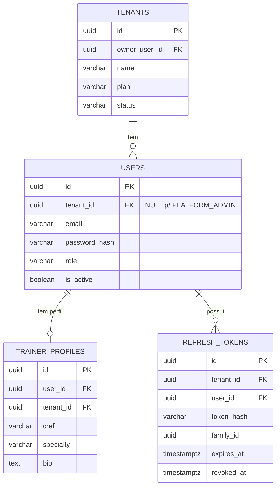
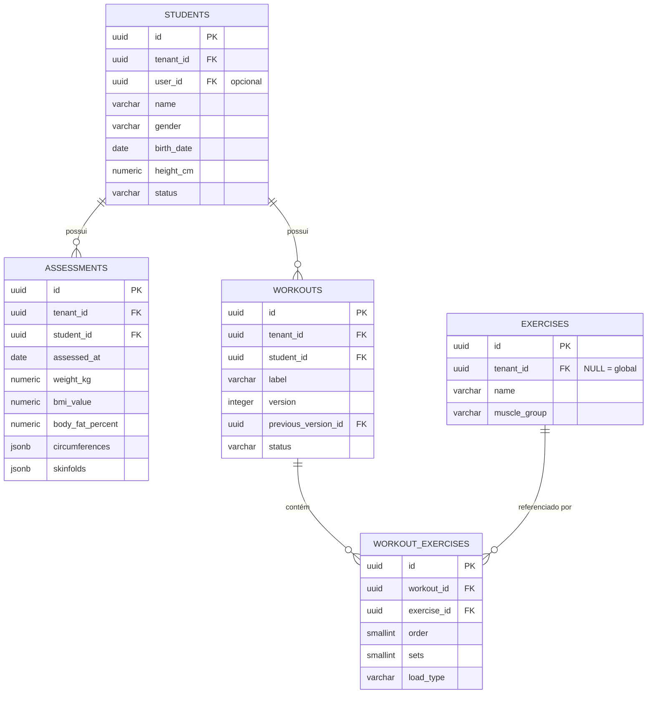
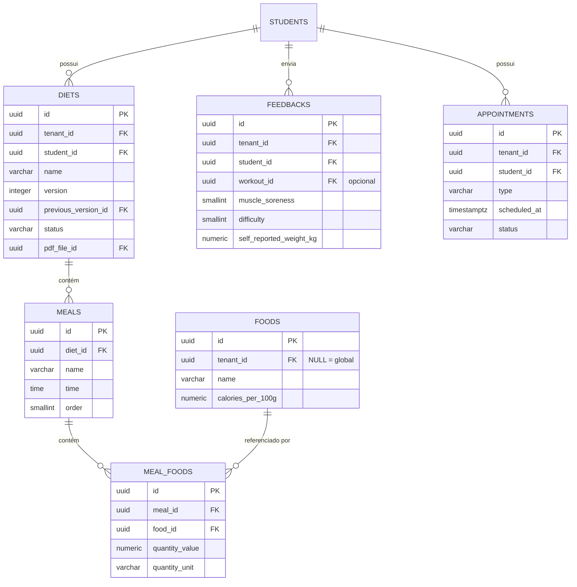
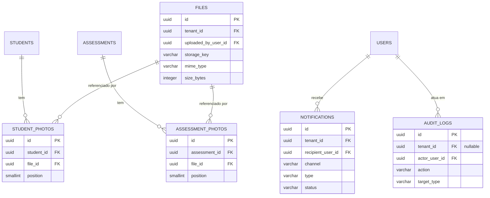

# FitHub — Banco de Dados

**Etapa 3 de 10** — Arquitetura ✅ → DDD ✅ → **Banco de Dados** → Prisma → Backend → Frontend → Mobile → Testes → Docker → Deploy

> Continuação de `DDD-MODEL.md`. Esta etapa é banco-primeiro e agnóstico de ORM de propósito — `database/schema.sql` e `database/row-level-security.sql` são SQL puro, rodam em qualquer Postgres. A Etapa 4 (Prisma) traduz isso pra `schema.prisma`, célula por célula, sem redesenhar nada.

## Sumário

1. O que foi implementado nesta etapa
2. Decisão: Value Objects compostos viram JSONB
3. Decisão: `tenant_id` denormalizado até nas tabelas filhas
4. Nota de bootstrap: referência circular tenants ↔ users
5. ERD — Identity & Tenancy
6. ERD — Core Domain (Students, Assessments, Workouts)
7. ERD — Diets, Feedback, Appointments
8. ERD — Files, Notifications, Auditoria
9. Estratégia de índices
10. Row-Level Security — os 3 padrões
11. Decisões desta etapa — preciso da sua confirmação
12. Próxima etapa

---

## 1. O que foi implementado nesta etapa

`database/schema.sql` — DDL completo, 20 tabelas, em ordem de dependência de FK.
`database/row-level-security.sql` — RLS pra todas as 20, nos 3 padrões da seção 10.

Cada tabela mapeia direto pra um Aggregate/Entity/Value Object da Etapa 2 — a rastreabilidade é intencional: se alguém perguntar "onde mora a regra X", a resposta deveria sempre dar pra apontar de volta pro `domain/` correspondente.

## 2. Decisão: Value Objects compostos viram JSONB

`Circumferences` e `Skinfolds` (Etapa 2) não viraram tabela própria com uma linha por ponto de medida. Motivo: o padrão de acesso é sempre "me dê a avaliação inteira" — nunca "me dê só a circunferência de cintura de todos os alunos". Normalizar isso em tabela própria compraria joins extras sem nenhum ganho de índice real. `assessments.circumferences` e `assessments.skinfolds` são JSONB com chave = nome do ponto, valor = medida numérica (unidade implícita pelo nome da coluna: cm pra circunferências, mm pra dobras).

Se esse padrão de acesso mudar (por exemplo, se a Etapa 8 de Evolução precisar de gráfico por ponto específico de circunferência ao longo do tempo, tipo "cintura mês a mês"), a migração pra tabela própria é localizada — só essas duas colunas, resto do schema não muda.

## 3. Decisão: `tenant_id` denormalizado até nas tabelas filhas

`workout_exercises`, `meals`, `meal_foods`, `student_photos`, `assessment_photos` têm `tenant_id` mesmo sendo tecnicamente derivável via join até a tabela pai (`workouts`, `diets`, `students`/`assessments`). Isso é redundância deliberada:

- RLS fica **uniforme** — toda tabela usa a mesma forma de política, sem política com subquery pra achar o tenant via join (mais lento, mais fácil de errar).
- Índice de tenant fica direto em toda tabela, sem depender de índice da tabela pai pra filtrar rápido.
- Reduz a superfície de "esqueci de aplicar RLS numa tabela porque ela não tinha tenant_id direto" — exatamente o tipo de furo que a seção 11 do ARCHITECTURE.md trata como inaceitável.

Custo: se `workout_exercises.tenant_id` e `workouts.tenant_id` algum dia divergirem (só aconteceria por bug de aplicação, já que nunca é editado depois de criado), isso seria um sinal de bug sério — vale considerar um trigger de validação na Etapa 5 se quiser essa garantia extra no banco.

## 4. Nota de bootstrap: referência circular tenants ↔ users

`tenants.owner_user_id` aponta pra `users.id`, e `users.tenant_id` aponta pra `tenants.id`. Resolvido assim no `schema.sql`:

1. `CREATE TABLE tenants` sem constraint de FK em `owner_user_id` (só a coluna).
2. `CREATE TABLE users` com FK normal pra `tenants(id)` (tenants já existe).
3. `ALTER TABLE tenants ADD CONSTRAINT ... FOREIGN KEY (owner_user_id) REFERENCES users(id)` depois que `users` existe.

Na prática (Etapa 5, fluxo de "criar conta de personal"): insere `Tenant` com `owner_user_id = NULL`, insere `User`, faz `UPDATE tenants SET owner_user_id = ...`. Vale envolver os três passos numa transação (Unit of Work).

## 5. ERD — Identity & Tenancy

## 6. ERD — Core Domain

`workouts.previous_version_id` referencia a própria tabela — omiti a seta de auto-relacionamento do diagrama por clareza visual, mas a coluna está lá (ver `schema.sql`) e o índice `uq_workouts_active_label` garante só 1 versão `ACTIVE` por `(student_id, label)`.

## 7. ERD — Diets, Feedback, Appointments

## 8. ERD — Files, Notifications, Auditoria

## 9. Estratégia de índices

Três categorias, todas em `schema.sql`:

| Categoria | Exemplo | Por quê |
|---|---|---|
| `tenant_id` isolado | `idx_students_tenant` | Toda query passa por aqui — é o que a Prisma Extension injeta automaticamente (Etapa 5) |
| Composto `(tenant_id, coluna_de_filtro)` | `idx_students_tenant_status`, `idx_appointments_tenant_scheduled` | Cobre os filtros mais comuns direto (lista de alunos ativos, próximos compromissos) |
| `(student_id, data DESC)` | `idx_assessments_student_date`, `idx_feedbacks_student_date` | A query mais cara do produto — histórico/gráfico de evolução de um aluno — vira index scan em vez de seq scan |
| Único parcial | `uq_workouts_active_label`, `uq_students_email_per_tenant` | Regra de negócio virando constraint de banco, não só validação de aplicação |

## 10. Row-Level Security — os 3 padrões

**Padrão A** (14 tabelas: files, trainer_profiles, students, student_photos, assessments, assessment_photos, workouts, workout_exercises, diets, meals, meal_foods, feedbacks, appointments, notifications) — `tenant_id` sempre presente, filtro direto.

**Padrão B** (exercises, foods) — catálogo híbrido: filtro por tenant OU `tenant_id IS NULL` (catálogo global visível pra todo mundo).

**Padrão C** (users, refresh_tokens, audit_logs, tenants) — `tenant_id` nulo é esperado (PLATFORM_ADMIN), então a política também aceita `app.is_platform_admin = true`. Esse setting só é ativado pela Prisma Extension depois de validar o JWT do Platform Admin — nunca por escolha do código de aplicação sozinho — e cada uso fica registrado em `audit_logs` (seção 11 do ARCHITECTURE.md, "acesso assistido").

## 11. Decisões desta etapa — preciso da sua confirmação

1. **`tenant_id` denormalizado em tabela filha** (seção 3) — mais storage redundante, isolamento mais uniforme. Se preferir normalizar e usar RLS com subquery, é uma mudança localizada.
2. **JSONB pra `circumferences`/`skinfolds`** (seção 2) — mantido da Etapa 2.
3. **Bypass de RLS via `app.is_platform_admin`** (Padrão C) — alternativa seria um role de banco dedicado com `BYPASSRLS`, gerenciado fora da aplicação. O `current_setting` é mais simples de implementar na Etapa 5; o role dedicado é mais forte mas exige gestão de credencial separada. Recomendo `current_setting` pro estágio atual, com plano de migrar se/quando tiver equipe de infra dedicada.
4. **Macros no `foods`** (`calories_per_100g`, `protein_g`, `carbs_g`, `fat_g`) — ainda pendente da Etapa 2, mantido aqui.
5. **`uq_diets_active_name`** — adicionei um único-por-nome-ativo em `diets`, espelhando `uq_workouts_active_label`, mesmo o briefing não tendo mencionado versionamento de dieta explicitamente. Faz sentido pelo mesmo motivo do treino ("PDF" e "plano alimentar" sugerem um documento formal que evolui). Posso remover se a intenção era mais simples.

## 12. Próxima etapa

Etapa 4 — Prisma: traduzir `schema.sql` pra `schema.prisma`, com os `generator`/`datasource`, os `@@map`/`@map` pra manter snake_case no banco com camelCase no TypeScript, os `enum` do Prisma pros `CHECK` constraints, a config de migration inicial, e o esqueleto da Prisma Client Extension de tenant (prometida na Etapa 1, seção 11) já batendo com as 20 tabelas daqui.
