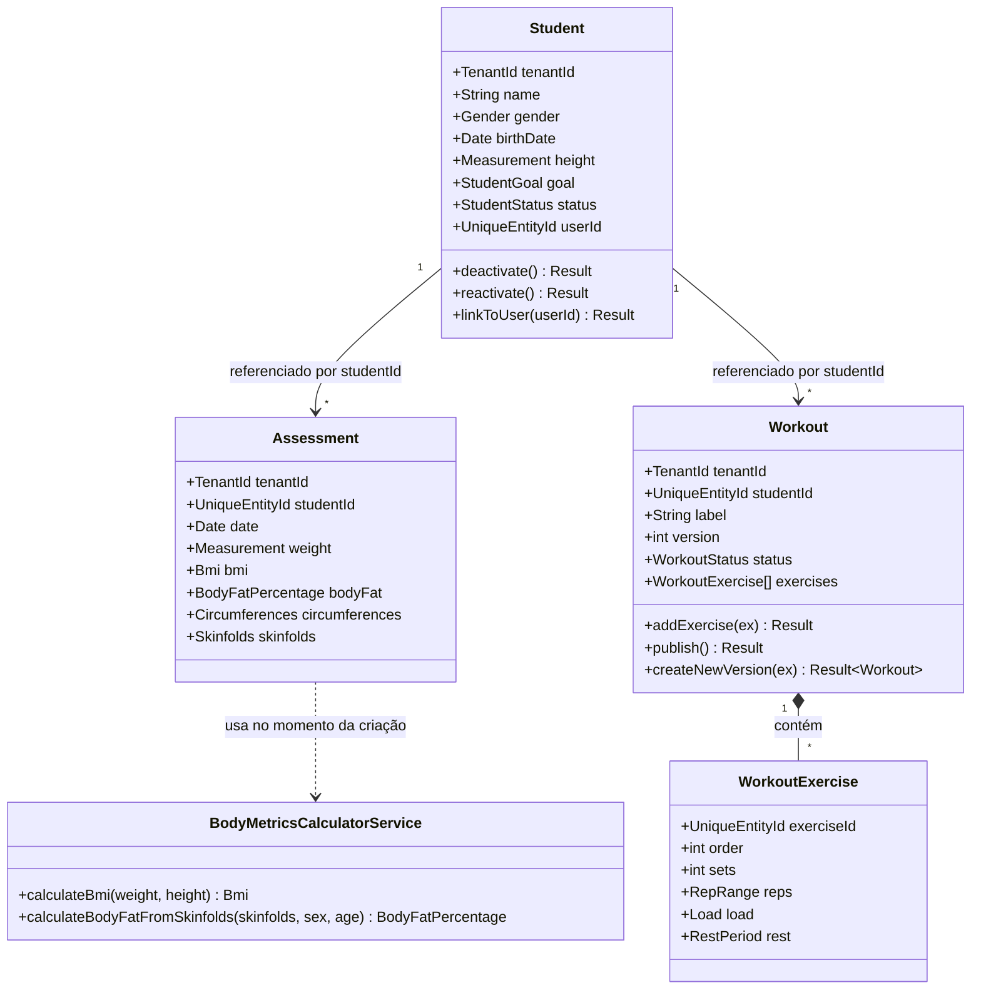

# FitHub — DDD Tático

**Etapa 2 de 10** — Arquitetura ✅ → **DDD** → Banco de Dados → Prisma → Backend → Frontend → Mobile → Testes → Docker → Deploy

> Continuação de `ARCHITECTURE.md`. O Core Domain (Students, Assessments, Workouts) foi implementado como código real em `apps/api/src/modules/*/domain/` — este documento explica as decisões e cobre os domínios de suporte e genéricos em nível de especificação. A Etapa 3 (Banco de Dados) deriva o Prisma schema diretamente do que está aqui — por isso o pedido de confirmação na seção 10.

## Sumário

1. O que foi implementado nesta etapa
2. Kernel de domínio compartilhado (`core/domain/`)
3. Core Domain — diagrama de classes
4. Students, Assessments, Workouts — resumo de invariantes
5. Domínios de suporte (especificação)
6. Domínios genéricos (especificação)
7. Dashboard e Notifications — por que não têm modelo de domínio próprio
8. Catálogo completo de Domain Events
9. Correção em relação à Etapa 1
10. Decisões desta etapa — preciso da sua confirmação
11. Próxima etapa

---

## 1. O que foi implementado nesta etapa

Todo o Core Domain saiu como código TypeScript de verdade, seguindo a estrutura `domain/{entities,value-objects,events,repositories,services}` definida na seção 13 do `ARCHITECTURE.md`:

```
apps/api/src/
├── core/domain/
│   ├── entity.ts                  # Entity + UniqueEntityId
│   ├── value-object.ts            # ValueObject base
│   ├── domain-event.ts            # DomainEvent base + IDomainEventPublisher
│   ├── aggregate-root.ts          # AggregateRoot (acumula domain events)
│   ├── result.ts                  # Result<T,E> + DomainError
│   └── shared-value-objects.ts    # TenantId, Measurement, DateRange, Email, PhoneNumber
├── modules/students/domain/       # entities, value-objects, events, repositories
├── modules/assessments/domain/    # + services/body-metrics-calculator.service.ts
└── modules/workouts/domain/       # entity filha WorkoutExercise dentro do agregado Workout
```

Domínios de suporte e genéricos (Exercises, Diets, Feedback, Appointments, Auth/Identity, Tenancy) estão especificados nas seções 5 e 6 abaixo com o mesmo nível de detalhe, mas ainda não materializados em arquivo — viram código na Etapa 5 (Backend), aplicando exatamente o padrão que o Core Domain já estabelece. Não há ganho em duplicar 6 módulos majoritariamente CRUD agora; há ganho em ter o padrão certo fixado nos 3 módulos que são realmente difíceis primeiro.

## 2. Kernel de domínio compartilhado (`core/domain/`)

Cinco peças que todo módulo reutiliza:

| Arquivo | O que resolve |
|---|---|
| `entity.ts` | Igualdade por identidade (`id`), não por valor |
| `value-object.ts` | Igualdade por valor, imutabilidade (`Object.freeze`) |
| `domain-event.ts` | Contrato de evento que o domínio conhece, sem depender do `EventEmitter2` |
| `aggregate-root.ts` | Acumula eventos em memória; Unit of Work só publica depois do commit |
| `result.ts` | `Result<T,E>` — erro de negócio esperado retorna, não lança |
| `shared-value-objects.ts` | `TenantId`, `Measurement`, `DateRange`, `Email`, `PhoneNumber` — o Shared Kernel restrito da seção 7 do ARCHITECTURE.md |

Todo Value Object de negócio (`Bmi`, `Load`, `StudentGoal`...) usa validação no factory method (`static create(...)`), nunca no constructor público — constructors são privados, então é estruturalmente impossível instanciar um VO inválido.

## 3. Core Domain — diagrama de classes



Note que as setas de `Student` para `Assessment`/`Workout` são de **referência por id**, não de composição — reforça a regra da seção 6 do ARCHITECTURE.md: cada um é seu próprio agregado, com seu próprio repositório, sua própria transação. Só `Workout` → `WorkoutExercise` é composição de verdade (`*--`): a exercise não existe, não é salva, não é consultada fora do Workout que a contém.

## 4. Students, Assessments, Workouts — resumo de invariantes

| Agregado | Invariante | Onde está no código |
|---|---|---|
| Student | Nome ≥ 2 caracteres; nascimento não pode ser no futuro | `Student.create()` |
| Student | Não pode desativar quem já está inativo (e vice-versa) | `deactivate()` / `reactivate()` |
| Student | Não pode linkar a um `User` se já existe link | `linkToUser()` |
| Assessment | Peso > 0 e ≤ 400kg; data não pode ser no futuro | `Assessment.create()` |
| Assessment | BMI é sempre snapshot calculado na criação, nunca recalculado depois | `body-metrics-calculator.service.ts` |
| Workout | Precisa de nome/label | `Workout.create()` |
| Workout | Ordem de exercício não pode repetir dentro do treino | `addExercise()` |
| Workout | Não publica treino vazio (0 exercícios) | `publish()` |
| Workout | Não versiona um treino já arquivado | `createNewVersion()` |

## 5. Domínios de suporte (especificação)

### Exercises (catálogo)

`Exercise` — aggregate root simples, sem child entities.

- Campos: `id`, `tenantId` **nullable**, `name`, `muscleGroup` (enum), `equipment[]` (enum), `description`, `videoUrl`, `imageUrl`, `tags[]`.
- `tenantId` nulo = catálogo global (curado por Platform Admin); preenchido = exercício custom daquele personal. Implementa a decisão híbrida da seção 2 do ARCHITECTURE.md.
- Evento: `ExerciseCreatedEvent` (baixo valor de negócio, principalmente invalidação de cache de listagem).

### Diets

`Diet` (aggregate root) → contém `Meal` (child entity) → contém `MealFood` (child entity, referencia `Food` por id + quantidade).

- `Diet`: `id`, `tenantId`, `studentId`, `name`, `status` (`ACTIVE`/`ARCHIVED`, mesmo padrão de versionamento do Workout), `meals: Meal[]`.
- `Meal`: `name` (ex: "Café da manhã"), `time`, `foods: MealFood[]`.
- `MealFood`: `foodId`, `quantity: Measurement`, `notes`.
- `Food` — catálogo separado, mesmo modelo híbrido global/tenant do Exercise: `name`, e eu adicionaria `caloriesPer100g`, `proteinG`, `carbsG`, `fatG` — não estava no briefing original, mas é dado esperado num catálogo de alimentos de app fitness (ver seção 10).
- Geração de PDF do plano alimentar **não é conceito de domínio** — é um adapter de Infrastructure (Etapa 5), o domínio só sabe montar o `Diet`.
- Eventos: `DietCreatedEvent`, `DietAssignedEvent`.

### Feedback

`Feedback` — aggregate root flat, sem child entities.

- Campos: `studentId`, `tenantId`, `date`, `workoutId?`, e uma `RatingScale` (VO reutilizável, inteiro 0–10 validado) para: `generalRating`, `muscleSoreness`, `difficulty`, `mood`, `energy`, `sleepQuality`. Mais `waterIntake: Measurement`, `selfReportedWeight?: Measurement`, `notes`.
- **Decisão importante**: `selfReportedWeight` é proposital e separado de `Assessment.weight`. Um é auto-relato informal no check-in, outro é medição formal do personal. A Etapa 9 (Evolução) consome os dois como séries distintas no mesmo gráfico, não funde os dois.
- **Decisão importante #2**: "alertar o personal se dor/dificuldade passar de um limiar" **não é invariante do agregado** — é política do módulo Notifications, que reage a `FeedbackSubmittedEvent` e decide, com um limiar configurável. Colocar isso dentro de `Feedback` prenderia uma regra de produto (que muda) dentro do domínio (que deveria mudar pouco).
- Evento: `FeedbackSubmittedEvent` (carrega o payload completo, pro handler de Notifications decidir sem re-consultar).

### Appointments

`Appointment` — aggregate root flat.

- Campos: `studentId`, `tenantId`, `type` (enum: `ASSESSMENT`, `CONSULTATION`, `WORKOUT_SESSION`, `OTHER`), `scheduledAt`, `durationMinutes`, `status` (`SCHEDULED`, `COMPLETED`, `CANCELLED`, `NO_SHOW`), `notes`.
- **Decisão importante**: `AppointmentReminderDueEvent` (Etapa 1) **não é disparado pelo agregado** — é um job BullMQ agendado (Etapa 5) que consulta "compromissos nas próximas N horas" e publica o evento. É um gatilho de tempo, não uma transição de estado do Appointment em si; o agregado não tem como "saber" que o relógio avançou.
- Eventos nativos do agregado: `AppointmentScheduledEvent`, `AppointmentCancelledEvent`, `AppointmentCompletedEvent`.

## 6. Domínios genéricos (especificação)

### Identity / Auth

`User` — aggregate root.

- Campos: `id`, `tenantId` (nulo só para `PLATFORM_ADMIN`), `email: Email`, `passwordHash` (opaco — o hash Argon2 acontece em Infrastructure, o domínio só guarda e compara), `role` (enum), `isActive`, `refreshTokens` (child entities: `tokenHash`, `familyId`, `expiresAt`, `revoked`).
- Eventos: `UserRegisteredEvent`, `UserPasswordChangedEvent`, `RefreshTokenReuseDetectedEvent` (crítico — token revogado sendo reapresentado é indício de roubo; dispara revogação de toda a família + alerta).
- Deliberadamente magro: é Generic Subdomain (seção 7 do ARCHITECTURE.md). O fluxo completo (assinatura de JWT, chamada ao Argon2) é Infrastructure/Application, Etapa 5.

### Tenancy

`Tenant` (aggregate root): `ownerUserId`, `name`, `plan` (enum), `status`.
`TrainerProfile` (aggregate root, 1:1 com `User` quando `role = PERSONAL_TRAINER`): `userId`, `cref?`, `specialty`, `bio`, `avatarFileId`, `phone`.

Eventos: `TenantCreatedEvent`, `TenantPlanChangedEvent`.

## 7. Dashboard e Notifications — por que não têm modelo de domínio próprio

Coerente com a decisão de CQRS seletivo (seção 9 do ARCHITECTURE.md):

- **Dashboard** não tem aggregate root. É projeção — tabelas/views de leitura populadas por handlers que consomem os eventos da seção 8. Modelar isso como "domínio" seria forçar DDD tático onde não há regra de negócio, só agregação de leitura. Estrutura completa vem na Etapa 5.
- **Notifications** tem uma entity simples de registro (`Notification`: `recipientUserId`, `channel`, `type`, `payload`, `status`) mas a inteligência de "qual evento vira qual notificação, com qual limiar" é política de Application layer (event handlers), não regra de domínio.

## 8. Catálogo completo de Domain Events

| Evento | Módulo | Disparado quando | Consumido por |
|---|---|---|---|
| `StudentCreatedEvent` | Students | Novo aluno cadastrado | Dashboard, Notifications |
| `StudentProfileUpdatedEvent` | Students | Dados de perfil alterados | Dashboard |
| `StudentDeactivatedEvent` | Students | Aluno marcado inativo | Dashboard |
| `StudentReactivatedEvent` | Students | Aluno reativado | Dashboard |
| `StudentLinkedToUserEvent` | Students | Acesso ao app habilitado | Notifications (convite) |
| `AssessmentCreatedEvent` | Assessments | Nova avaliação registrada | Dashboard, Evolução |
| `AssessmentUpdatedEvent` | Assessments | Avaliação corrigida | Dashboard, Evolução |
| `WorkoutCreatedEvent` | Workouts | Novo treino criado | Dashboard |
| `WorkoutVersionedEvent` | Workouts | Nova versão de um treino existente | Dashboard |
| `WorkoutAssignedEvent` | Workouts | Treino publicado pro aluno | Notifications |
| `WorkoutArchivedEvent` | Workouts | Versão antiga arquivada | — |
| `ExerciseCreatedEvent` | Exercises | Exercício adicionado ao catálogo | — (cache) |
| `DietCreatedEvent` | Diets | Novo plano alimentar criado | Dashboard |
| `DietAssignedEvent` | Diets | Dieta publicada pro aluno | Notifications |
| `FeedbackSubmittedEvent` | Feedback | Aluno envia check-in | Dashboard, Evolução, Notifications (política de limiar) |
| `AppointmentScheduledEvent` | Appointments | Compromisso agendado | Notifications |
| `AppointmentCancelledEvent` | Appointments | Compromisso cancelado | Notifications |
| `AppointmentCompletedEvent` | Appointments | Compromisso concluído | Dashboard |
| `AppointmentReminderDueEvent` | Appointments (job) | Job assíncrono detecta compromisso próximo | Notifications |
| `UserRegisteredEvent` | Identity | Novo User criado | Notifications (boas-vindas) |
| `UserPasswordChangedEvent` | Identity | Senha alterada | Auditoria, Notifications (alerta) |
| `RefreshTokenReuseDetectedEvent` | Identity | Token revogado reutilizado | Auditoria, Notifications (alerta de segurança) |
| `TenantCreatedEvent` | Tenancy | Novo tenant provisionado | — |
| `TenantPlanChangedEvent` | Tenancy | Plano alterado | Auditoria, Notifications |

## 9. Correção em relação à Etapa 1

A tabela de eventos do `ARCHITECTURE.md` (seção 10) listava `AssessmentCreatedEvent` como consumido por Notifications "ex: meta batida". Removi essa relação aqui: comparar a avaliação atual com a meta do aluno e com avaliações anteriores exige ler dois agregados diferentes (`Assessment` + `Student.goal` + histórico de `Assessment`) — isso não é algo que o agregado `Assessment`, sozinho, tem visibilidade para decidir. Um possível `GoalAchievedEvent` faria mais sentido como evento de **Application layer**, disparado pelo Use Case depois de orquestrar as leituras, não pelo domínio. Ajuste pequeno, mas o tipo de coisa que fica mais barato corrigir agora do que depois do Prisma schema.

## 10. Decisões desta etapa — preciso da sua confirmação

1. **Peso não fica no `Student`** — só em `Assessment` (formal) e `Feedback` (self-report informal), ambos alimentando a Evolução como séries separadas.
2. **`Food` ganha macros** (`caloriesPer100g`, `proteinG`, `carbsG`, `fatG`) — não pedido no briefing original, mas adicionei por ser esperado num catálogo de alimentos. Se não fizer sentido pro produto, tiro na Etapa 3.
3. **Fórmula de composição corporal** (Jackson-Pollock 3 dobras) implementada e conferida contra a publicação original — mas o código já deixa comentado que precisa de revisão por profissional de Educação Física antes de produção, e que 7 dobras (mais precisa) deveria ser configurável.
4. **Versionamento de Workout e Diet por criação de nova instância** (não mutação in-place) — mais fiel ao requisito de "Histórico", mas significa que o Prisma schema (Etapa 3) precisa de `previousVersionId` auto-referenciado.
5. **`GoalAchievedEvent` removido do domínio**, vira decisão de Application layer (seção 9 acima).

## 11. Próxima etapa

Etapa 3 — Banco de Dados: transformar cada `Props` interface e Value Object acima num modelo relacional — tabelas, colunas, tipos, índices (principalmente os compostos com `tenantId`), foreign keys, e a estratégia de armazenamento pros Value Objects que não mapeiam 1:1 pra coluna simples (`Circumferences`/`Skinfolds` viram JSON ou tabelas próprias — decisão que vale registrar explicitamente na Etapa 3). Meu plano é ir com JSON tipado pra esses dois (leitura sempre inteira, nunca query por ponto específico de dobra) e tabela própria só onde há necessidade real de índice/query, mas confirmo isso como decisão explícita quando chegar lá.
